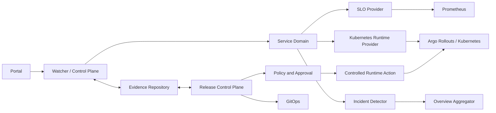

# S Sentinel

**S Sentinel is an SLO-driven Reliability Control Platform.** It continuously
correlates service SLOs, Kubernetes runtime state, releases, and reliability
incidents, then uses policy-governed, human-approved remediation to support
safe reliability operations.

It turns isolated operational signals into one control loop:

```text
Observe -> Detect -> Correlate -> Decide -> Govern -> Execute -> Verify
```

## Why S Sentinel

Prometheus, Kubernetes, Argo Rollouts, GitOps, policy decisions, and incident
handling are often useful but disconnected. S Sentinel connects them around a
Service-first reliability model. The existing Release Control Plane remains a
subsystem: it supplies release evidence, advisor recommendations, policy,
approval, execution, and audit context to the reliability platform.

Unlike a generic Kubernetes dashboard or a rollout-only demo, S Sentinel
answers: *is this Service reliable now, what release is relevant, and what
controlled action is safe to consider?*

## Core Model

```text
Service -> SLO
        -> Runtime
        -> Releases
        -> Incidents

Incident -> Recommendation -> Policy -> Approval
         -> Controlled Remediation -> Verification
```

## Architecture



## Key Capabilities

- Service Catalog with runtime, SLO, and delivery references
- SLO status, error budget, and 1h / 6h / 24h burn rates
- Argo Rollout runtime visibility
- Real-time reliability incident detection and release correlation
- Fleet reliability overview
- Release evidence, advisor, policy, approval, and GitOps compatibility plane
- Policy-controlled remediation and post-action verification

## Safety Model

Runtime mutations are disabled by default. Incident detection never triggers
an automatic rollback. A real Runtime Action requires a matching release
recommendation, policy allowance, approval, an existing preflight, global and
action gates, an explicit execute switch, and post-action verification. See
[docs/architecture.md](docs/architecture.md) for the safety boundary.

## Demo Flow

`demo-app` can demonstrate a healthy Service, SLO degradation, incident/release
correlation, and a blocked-by-default remediation preview. Real action demos
are opt-in and require every safety gate. See [docs/demo.md](docs/demo.md).

## Repository Layout

| Path | Purpose |
|---|---|
| `watcher/` | Control Plane, Service domains, Portal API |
| `web/` | S Sentinel Portal |
| `configs/` | Service, SLO, strategy, and environment configuration |
| `schemas/` | Release and control-plane contracts |
| `scripts/` | Existing Release, Evidence, policy, and runtime pipelines |
| `deploy/` | Kubernetes, Argo Rollouts, and monitoring manifests |
| `demo-app/` | Demonstration workload |

## Quick Start

Required for local development: Go, Node.js with pnpm, Python 3, and Git Bash
or another Bash environment. Kubernetes, Argo Rollouts, and Prometheus are
optional for API/UI development; their live states surface as `UNKNOWN` when
unavailable. Ollama is only needed for advisor flows.

```bash
cd watcher && go test ./...
cd ../web && pnpm install --frozen-lockfile && pnpm run build
cd .. && bash scripts/test-release-contracts.sh
```

Run the watcher with a configuration such as `watcher/config.k8s.yaml` only in
an environment that has Kubernetes access. Use [docs/demo.md](docs/demo.md)
for the complete demonstration sequence.

## Core APIs

```text
GET /api/v1/overview
GET /api/v1/services
GET /api/v1/services/{name}
GET /api/v1/services/{name}/slo
GET /api/v1/services/{name}/runtime
GET /api/v1/services/{name}/incidents
GET /api/v1/incidents
GET /api/v1/incidents/{id}
GET /api/v1/incidents/{id}/remediation
```

The existing `/api/releases` and `/api/evidence` families remain the Release
Control Plane and Evidence entry points. Internal GitOps artifact endpoints are
deliberately not the primary product API.

## Current Scope and Limitations

- Services are configuration-driven; there is no Service database.
- Runtime visibility currently targets Argo Rollouts.
- Incidents are calculated in real time and have no historical persistence.
- Remediation idempotency is watcher-process-local.
- SLO status is queried from Prometheus at evaluation time.
- The Release / GitOps compatibility pipeline still has detailed artifacts.
- Release Evidence compatibility remains in place for existing consumers.
